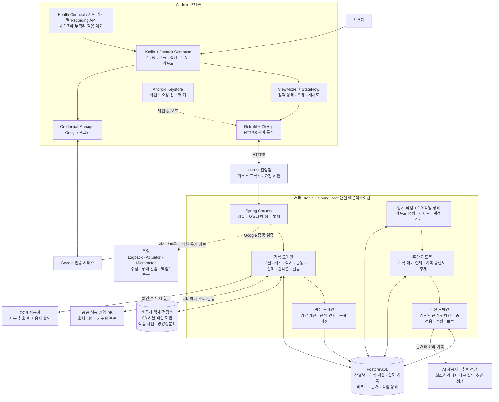
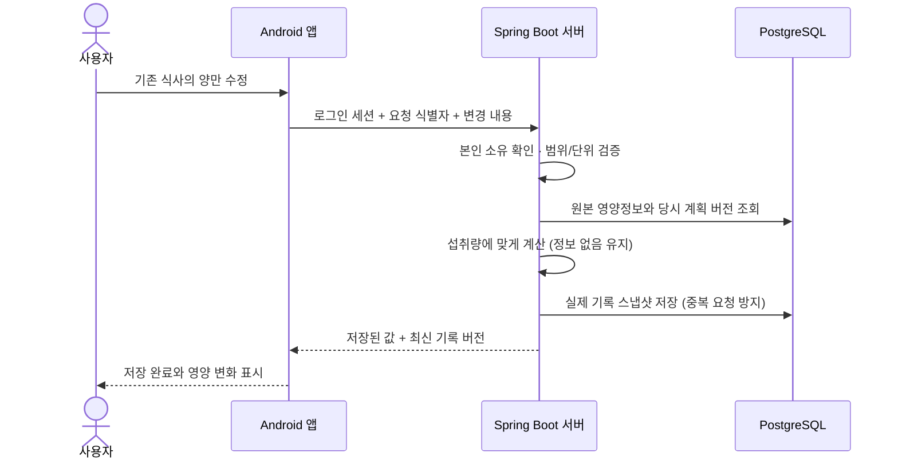

# RoutinLog 전체 아키텍처

2026-09-30 · 구현 전 기준 설계 · Android / Google 로그인 / 온라인 기록

이 문서는 목표 구조다. 연결선이 있다고 해당 외부 서비스가 연결되거나 배포된 것은 아니다. 구현 범위와 검증 결과는 [그림으로 보는 프로젝트 안내](index.html)에서 확인한다.

## 1. 전체 구성

## 2. 왜 이렇게 나누는가

| 영역 | 역할 | 우리 서비스 예시 |
|---|---|---|
| Android 앱 | 입력과 화면, 기기 권한, 진행 상태 표시 | 닭가슴살을 200g에서 250g으로 변경 |
| 서버 | 입력 검증, 계산, 본인 기록만 접근, 저장 | 원본 영양정보로 다시 계산하고 저장 완료 응답 |
| PostgreSQL | 관계가 있는 기록과 버전 보관 | 그날 목표·먹은 양·계산 출처를 함께 보존 |
| 객체 저장소 | 큰 파일을 비공개로 보관 | 제품 사진과 영양성분표 사진 |
| 정기 작업 | 앱을 열지 않아도 서버에서 실행 | 월요일에 지난주 리포트 생성, 실패 시 재시도 |
| AI | 검토된 근거를 기록과 연결해 설명·초안 제안 | 자주 빠진 운동을 가능한 요일로 옮기는 안 |

서버 내부의 상자들은 각각 별도 서버가 아니다. 처음에는 한 Spring Boot 애플리케이션으로 배포하고, 코드만 기능별로 구분한다. 앱과 서버는 같은 Kotlin을 사용하더라도 서로 다른 실행 프로그램이다.

## 3. 기록이 저장되는 흐름

- 앱은 온라인 전용이다. 오프라인 기록 DB나 나중에 몰아서 전송하는 기능은 넣지 않는다.
- 저장 응답이 없으면 완료로 표시하지 않는다. 입력창 내용은 유지하고 재시도할 수 있다.
- 서버는 계정 ID를 요청 내용에서 믿지 않고 검증된 로그인 정보로 결정한다.
- 같은 저장 요청의 재전송은 한 번만 처리한다. 다른 기기의 수정 충돌은 버전으로 감지한다.
- 영양정보의 미확인 값과 0을 구분하고, 식사·식품을 수정해도 과거 실제 기록을 덮어쓰지 않는다.

## 4. 주간 리포트와 제안

1. 사용자의 시간대 기준 지난주 날짜별 계획 버전과 실제 기록을 모은다.
2. 누락된 날·끼니·걸음 동기화 상태를 먼저 구분한다. 미기록은 0으로 간주하지 않는다.
3. 코드는 칼로리·탄단지·체중·허리·운동 수행량을 집계한다. 운동 간 무게를 단순 등가로 비교하지 않는다.
4. AI에는 필요한 요약과 검토된 근거만 전달한다. 원본 사진·Google 식별자·이메일은 기본 전달 대상이 아니다.
5. AI의 설명과 수정 초안을 서버가 규칙과 근거 ID로 검증한다. 체중 변화의 원인을 단정하거나 지난주 부족분을 다음주에 몰아 채우지 않는다.
6. 사용자가 적용해야 새 계획 버전이 만들어진다. 수정·보류와 이유도 다음 제안에 활용할 수 있게 기록한다.

AI 연결이 실패해도 숫자·추세 리포트는 제공한다. 최초 영양 목표와 운동 프로그램의 구체적인 정책은 별도 과학적 검토와 버전 관리 대상이며, 시안의 가상 수치를 출시 기준으로 확정하지 않는다.

## 5. 로그인·걸음·삭제의 경계

- Google 로그인: Credential Manager가 받은 인증 증명을 서버가 발급자·대상 앱·유효기간 등으로 검증한 뒤 내부 user_id와 자체 세션으로 연결한다. Google ID 토큰을 영구 앱 세션처럼 사용하지 않는다.
- 세션: 짧은 접근 토큰과 회전·폐기가 가능한 갱신 세션을 설계한다. 서버는 계정 활성 상태를 확인한다. 앱에는 Keystore 키로 보호한 세션 값만 저장한다.
- 걸음: Health Connect의 집계 또는 지원 기기의 Local Recording API 등에서 읽는다. 두 출처를 무조건 합산하지 않는다. 휴대폰/플랫폼별 지원 차이와 동기화 시점을 표시한다. 시스템 누적과 서버 업로드는 별개다.
- 삭제: 본인 재확인 → 범위 안내 → 계정 접근 차단/세션 폐기 → 원본·사진·리포트·제안 삭제 작업 → 처리 결과 안내. 법적 보관 대상과 백업 만료 정책은 구분한다.
- 음식 사진: 비공개 보관, 인증된 사용자에게만 짧은 유효기간의 접근 주소 발급. 파일 크기·실제 형식 검증과 불필요한 사진 메타데이터 제거를 적용한다.
- 외부 AI/OCR·클라우드의 계약·리전·보관 조건·개인정보 처리는 실제 제공자 선정 후 확정한다. 서울 리전 선택만으로 모든 국외 이전 문제가 해결되는 것은 아니다.

## 6. 배포 구성과 이번 시작 범위

배포 후보는 AWS 서울 리전이다. HTTPS 진입점, 컨테이너 실행 환경, 관리형 PostgreSQL, 비공개 S3, 운영 로그 수집을 구성한다. 구체적인 서버 상품·요금은 배포 단계에 결정하며 이번 작업에서 유료 자원을 생성하지 않는다.

- 개발 환경: Android Studio/에뮬레이터 + 로컬 Spring Boot + Docker PostgreSQL.
- 자동 검증: GitHub Actions에서 서버 테스트, Android 빌드/테스트, 비밀정보가 없는 설정 확인.
- 운영 관측: 서버 로그와 운영 지표를 구분한다. AWS 사용 시 CloudWatch Logs를 우선 후보로 두며, 초기부터 Loki/Prometheus/Grafana를 모두 별도로 운영하지 않는다.
- 이번 시작: 저장소 구조, 앱/서버 실행 뼈대, 보안 기본 설정, 계산 규칙의 첫 테스트, 개발 실행 안내.
- 후속 구현: Google 실제 로그인·동의 → 기록 저장 → 식사/운동 편집 → 걸음 연결 → 수치 리포트 → 근거 기반 제안 → 탈퇴·운영·스토어 검증.

## 7. 참고

- [Android 권장 아키텍처](https://developer.android.com/topic/architecture/recommendations)
- [Spring Boot의 Kotlin 지원](https://docs.spring.io/spring-boot/reference/features/kotlin.html)
- [Credential Manager](https://developer.android.com/identity/credential-manager)
- [Health Connect](https://developer.android.com/health-and-fitness/health-connect)
- [Local Recording API](https://developer.android.com/health-and-fitness/recording-api)
